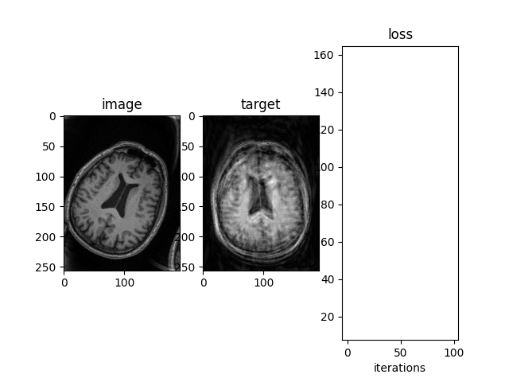
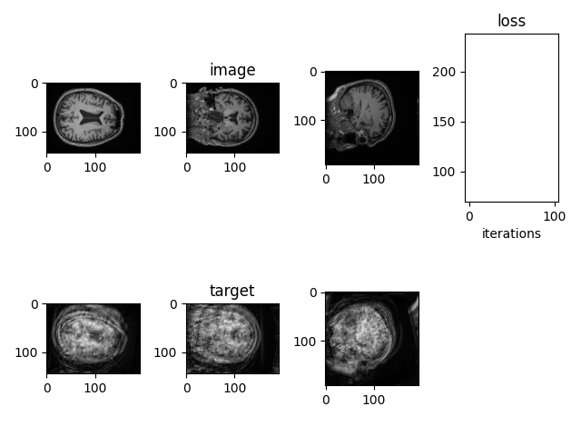

# Differentiable MRI Motion Model

This python code can be used to generate patient movement artefacts in MRI scans.\
It is fully differentiable and can be applied to both 2D or 3D images.

2D:

3D:

# Citation

If you use this code, please consider citing my papers:
<pre>
@article{ShawIEEE2020,
    author={R. Shaw and C. H. Sudre and T. Varsavsky and S. Ourselin and M. J. Cardoso},
    journal={IEEE Transactions on Medical Imaging},
    title={A k-Space Model of Movement Artefacts: Application to Segmentation Augmentation and Artefact Removal},
    year={2020},
    volume={39},
    number={9},
    pages={2881-2892},
    doi={10.1109/TMI.2020.2972547}}

@inproceedings{ShawMIDL2019,
    title={MRI k-Space Motion Artefact Augmentation: Model Robustness and Task-Specific Uncertainty},
    author={R. Shaw and C. H. Sudre and S. Ourselin and M. J. Cardoso},
    booktitle={MIDL},
    year={2019}
}
<pre>
